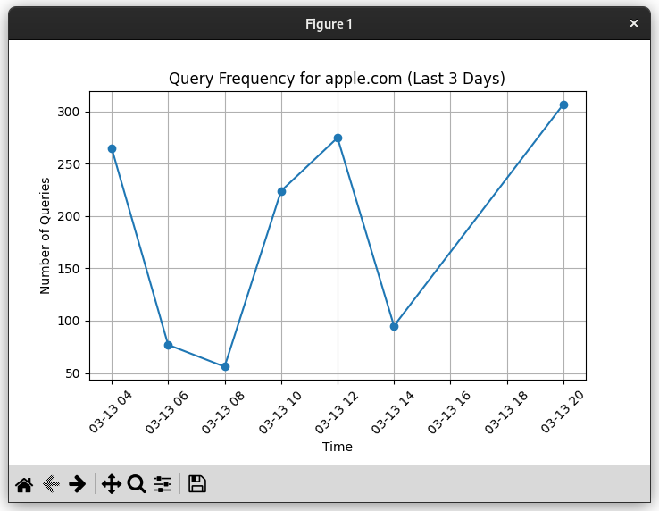

# AdGuard DNS Query Analyzer

A tool for analyzing AdGuard Home DNS queries with graphical visualization and domain frequency statistics.

## Features

- Load JSON logs from AdGuard Home.
- Search and visualize query frequency for a specific domain.
- Display the most queried domains and client statistics.

## Installation

### Prerequisites
- Python 3.x
- Required dependencies:
  ```sh
  pip install matplotlib tldextract
  ```

## Usage

1. **Run the main application** (Graphical Interface):
   ```sh
   python analyzer.py
   ```
   - Load an AdGuard query log file.
   - Search for a domain to visualize its query frequency.

2. **Run `topqueries.py` for command-line statistics**:
   ```sh
   python topqueries.py
   ```
   - Displays the top 10 queried domains.
   - Shows the most queried domains per client IP.

## Use Cases

### 1. Monitoring Network Activity
- Track which domains are being queried the most on your network.  
- Identify excessive queries to specific domains, which could indicate tracking, malware, or unnecessary traffic.  

### 2. Identifying Suspicious Activity
- Detect unusual spikes in DNS queries to unknown or suspicious domains.  
- Check if a specific device is making an unusual number of requests to a certain domain.  

### 3. Parental Control & Content Filtering
- Review which websites are being accessed frequently.  
- Monitor and fine-tune AdGuard’s filtering settings based on real usage data.  

### 4. Performance Optimization
- Identify slow-loading or frequently queried domains that may be affecting network performance.  
- Optimize DNS blocking rules for a better browsing experience.  

### 5. Debugging & Troubleshooting
- Determine whether DNS queries are being properly blocked or resolved.  
- Analyze failed queries to diagnose connectivity issues.  

## File Descriptions

- `analyzer.py` - GUI application for visualizing query data.
- `topqueries.py` - Command-line tool for analyzing top queried domains.
- `adguard_queries.json` - Example JSON log file (not included).

## Example Graph

When searching for a domain, the tool generates a query frequency graph:



## License

This project is licensed under the MIT License.
